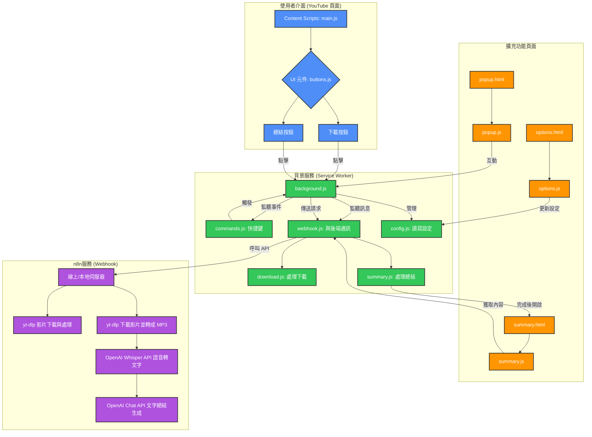
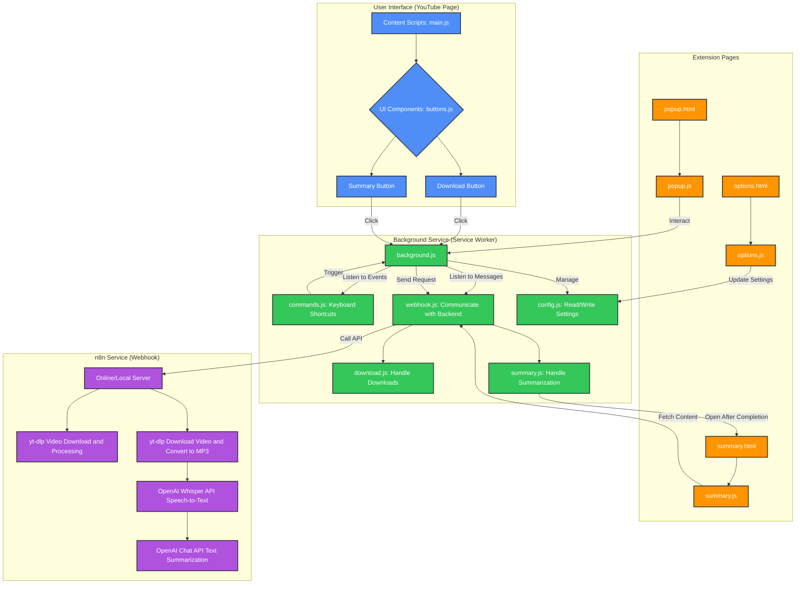

# YouTube 擴充功能 | YouTube Extension

[繁體中文](#繁體中文) | [English](#english)

## 繁體中文

### 簡介

這是一個 Chrome 擴充功能，可以幫助用戶下載 YouTube 影片並提供影片總結功能。擴充功能支援選擇不同的品質和格式進行下載。

### 功能

- 下載 YouTube 影片
- 支援選擇不同的品質（最高、高、中、低）
- 支援不同的格式（MP4、MP3）
- 影片總結功能（改進版）
  - 整合式總結頁面設計，提供更流暢的使用體驗
  - 自動在影片總結完成後顯示結果
  - 英文影片自動轉為中文總結
- 支援線上和本地模式切換
- 後台服務持續運行機制，確保擴充功能穩定運作

### 安裝步驟

1. 下載或克隆此代碼庫
2. 在 `config` 資料夾中複製 `config.example.json` 為 `config.json` 並填入您的實際配置參數
3. 在 Chrome 瀏覽器中，前往 `chrome://extensions/`
4. 開啟「開發者模式」
5. 點擊「載入未封裝項目」，選擇擴充功能資料夾

### 使用方法

1. 在 YouTube 影片頁面上，會出現一個紅色的下載按鈕和綠色的總結按鈕
2. 點擊下載按鈕可以下載當前影片
3. 點擊總結按鈕可以查看或生成影片的文字總結
4. 使用快捷鍵 `Command+Shift+6`（Mac）或 `Ctrl+Shift+6`（Windows/Linux）快速下載當前影片
5. 使用快捷鍵 `Command+Shift+9`（Mac）或 `Ctrl+Shift+9`（Windows/Linux）切換線上/本地模式
6. 中鍵點擊按鈕可以隱藏所有按鈕，再次點擊頁面即可顯示

### 配置

在 `config/config.json` 中設置以下參數：

```json
{
  "SERVICE_URLS": {
    "download_and_summary": {
      "online": "https://your-online-webhook-url.com/webhook/download-video",
      "local": "http://localhost:5678/webhook/download-video"
    },
    "file_url": {
      "online": "https://your-download-base-url.com/",
      "local": ""
    },
    "get_summary": {
      "online": "https://your-online-webhook-url.com/webhook/summary-content",
      "local": "http://localhost:5678/webhook/summary-content"
    }
  },
  "BEARER_TOKEN": "your-bearer-token-here",
  "IS_ONLINE_MODE": true,
  "VIDEO_SETTINGS": {
    "quality": "highest",
    "format": "mp4"
  }
}
```

### 系統架構


### 檔案結構

```
.
├── assets/            # 圖標和其他資源檔案
├── config/            # 配置檔案
├── css/               # 樣式表
├── html/              # HTML 頁面
├── js/                # JavaScript 檔案
│   ├── core/          # 核心功能
│   ├── features/      # 功能模組
│   ├── pages/         # HTML 頁面專用的 JS
│   ├── service_worker/ # 背景腳本
│   ├── ui/            # 使用者介面相關
│   └── utils/         # 工具函數
├── manifest.json      # 擴充功能設定檔
└── README.md         # 說明文件
```

### 開發

1. 修改代碼後，重新載入擴充功能以應用更改
2. 請確保不要將 `config/config.json` 推送到公共代碼庫

---

## English

### Introduction

This is a Chrome extension that helps users download YouTube videos and provides video summarization functionality. The extension supports selecting different quality and format options for downloads.

### Features

- Download YouTube videos with one click
- Support for different quality options (highest, high, medium, low)
- Support for different formats (MP4, MP3)
- Video summarization functionality (improved)
  - Integrated summary page design for a smoother experience
  - Automatic display of results after video summarization is complete
  - Automatic translation of English video summaries to Chinese
- Toggle between online and local service modes
- Background service continuous operation mechanism for stable extension performance
- Keyboard shortcuts for quick actions

### Installation

1. Download or clone this repository
2. Copy `config.example.json` to `config.json` in the `config` folder and fill in your actual configuration parameters
3. In Chrome browser, go to `chrome://extensions/`
4. Enable "Developer mode"
5. Click "Load unpacked" and select the extension folder

### Usage

1. On a YouTube video page, a red download button and a green summary button will appear
2. Click the download button to download the current video
3. Click the summary button to view or generate a text summary of the video
4. Use the shortcut `Command+Shift+6` (Mac) or `Ctrl+Shift+6` (Windows/Linux) to quickly download the current video
5. Use the shortcut `Command+Shift+9` (Mac) or `Ctrl+Shift+9` (Windows/Linux) to toggle between online/local modes
6. Middle-click on any button to hide all buttons, click anywhere on the page to show them again

### Configuration

Set the following parameters in `config/config.json`:

```json
{
  "SERVICE_URLS": {
    "download_and_summary": {
      "online": "https://your-online-webhook-url.com/webhook/download-video",
      "local": "http://localhost:5678/webhook/download-video"
    },
    "file_url": {
      "online": "https://your-download-base-url.com/",
      "local": ""
    },
    "get_summary": {
      "online": "https://your-online-webhook-url.com/webhook/summary-content",
      "local": "http://localhost:5678/webhook/summary-content"
    }
  },
  "BEARER_TOKEN": "your-bearer-token-here",
  "IS_ONLINE_MODE": true,
  "VIDEO_SETTINGS": {
    "quality": "highest",
    "format": "mp4"
  }
}
```

### System Architecture


### File Structure

```
.
├── assets/            # Icons and other resource files
├── config/            # Configuration files
├── css/               # Stylesheets
├── html/              # HTML pages
├── js/                # JavaScript files
│   ├── core/          # Core functionality
│   ├── features/      # Feature modules
│   ├── pages/         # JS for HTML pages
│   ├── service_worker/ # Background scripts
│   ├── ui/            # User interface related
│   └── utils/         # Utility functions
├── manifest.json      # Extension configuration file
└── README.md         # Documentation
```

### Development

1. After modifying the code, reload the extension to apply changes
2. Make sure not to push `config/config.json` to public repositories
